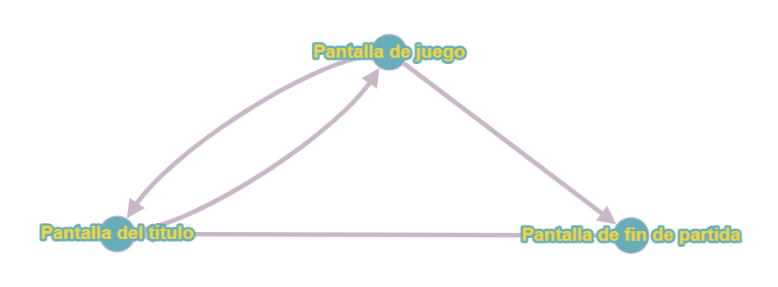

# PEC1: UN JUEGO DE AVENTURAS

# ¿Cómo se juega?
El objetivo del juego es reducir a zero la salud del enemigo. Tanto el jugador como el enemigo disponen de cinco puntos de salud.
El juego esta dividido en rondas en las que el jugador y el enemigo tendrán el rol de insultador y de réplica.
Si el jugador es el que insulta basta con escoger un insulto de la lista, el enemigo cogerá una réplica al azar. Si la réplica escogida por el enemigo no es correcta, el jugador le inflinjirá un punto de daño y volverá a insultar en la próxima ronda. En cambio, si el enemigo consigue una réplica correcta este inflinjirá un punto de daño al jugador y pasará a ser el que insulta en la siguiente ronda.
Por el contrario si el jugador es el que hace la réplica deberá fijarse en el insulto propiciado por el enemigo para escoger una réplica acorde. Si la réplica falla el jugador pierde un punto de salud y el enemigo sera el que insulta en la siguiente ronda. En cambio si la réplica es correcta el jugador inflinjirá un punto de daño al enemigo y será el encargado de insultarlo en la próxima ronda.
El juego continua hasta que el jugador o el enemigo pierde todos los puntos de salud.

# Pantallas
> El juego se compone de tres scenas: La pantalla de título, la pantalla de juego y la pantalla de fin de partida.

## Pantalla del título
En esta pantalla se puede iniciar partida o salir de la aplicación. Para ello dispone de dos botones. Uno inicia la partida y el otro abre un pequeño menú de confirmación para verificar si el jugador realmente desea salir de la aplicación.

## Pantalla de Juego
La pantalla más importante, esta dividida en dos partes horizontales. En la parte superior se muestra la escena del combate y una parte de la interfaz de usuario que representa los puntos de salud del jugador y del enemigo.
En la parte inferior tenemos la interfaz de los insultos. En esta parte se formará una lista con los insultos y las réplicas que puede utilizar el jugador en función de si esta insultando o replicando al enemigo.

## Pantalla de Fin de partida
En esta pantalla se accede en el momento en el que el jugador gana o pierde la partida. Dependiendo del resultado se mostrará una animación de victoria o derrota con un clip de audio acorde a la situación. En esta pantalla el jugador solo dispone de un botón para volver a la pantalla del título para seguir con el flujo del juego.

# Flujo de juego

# Máquina de estados

# Decisiones de diseño
## Diseño de la interfaz de juego
Al aspirar a realizar todos los apartados extra de la práctica he decidido crear una interfaz gráfica que sea compatible para todas las plataformas. Documentándome sobre el juego descubrí que la primera versión en los combates solo muestra la acción en la mitad superior de la pantalla. La parte inferior queda para que el jugador pueda escoger el insulto. 

## Leer insultos de fichero

## Pantalla de pausa

## 

# Recursos de terceros utilizados

- Sprites del jugador: <a href="https://luizmelo.itch.io/medieval-warrior-pack" target="_blank">Medieval Warrior pack</a>, by Luiz Melo.
- Sprites del enemigo: <a href="https://luizmelo.itch.io/medieval-warrior-pack-2" target="_blank">Medieval Warrior pack 2</a>, by Luiz Melo.
- Fondo de la pantalla principal: <a href="https://edermunizz.itch.io/free-pixel-art-hill" target="_blank">Pixel Art Hill</a>, by Eder Munizz.
- Fondo de la pantalla de juego: <a href="https://edermunizz.itch.io/free-pixel-art-forest" target="_blank">Pixel Art forest</a>, by Eder Munizz.
- Botones: <a href="https://mounirtohami.itch.io/pixel-art-gui-elements" target="_blank">Pixel Art GUI Elements</a>, by Mounir Tohami.
- Barras de salud: <a href="https://pixellad.itch.io/colourful-game-ui-kit-expansion-1" target="_blank">Colourful Game-UI Kit Expansion 1</a>, by Pixel Lad.
- Fuente de texto: <a href="https://vrtxrry.itch.io/dungeonfont" target="_blank">Dungeon Font</a>, by vrtxrry.
- <a href="https://monkeyisland.fandom.com/wiki/Insult_Sword_Fighting" target="_blank">Insultos de Monkey Island</a>.
- Música de fondo de la pantalla principal: <a href="https://alecxs-sunders.itch.io/rpgjrpg-5-songs-free-pack" target="_blank">RPG/JRPG 5 Songs Free Pack</a>, by Alecxs Sunders.
- <a href="https://mixkit.co/free-sound-effects/sword/" target="_blank">Clip de audio de espada</a>
- <a href="https://mixkit.co/free-sound-effects/win/" target="_blank">Clip de audio de audio de victoria y derrota</a>
