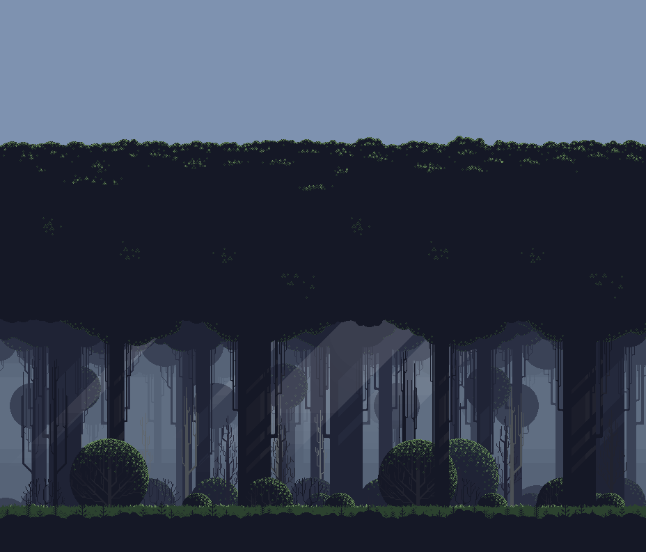

## Índice
- [1. ¿Cómo se juega?](#1-cómo-se-juega)
- [2. Pantallas](#2-pantallas)
  - [2.1. Pantalla del Título](#21-pantalla-del-título)
  - [2.2. Pantalla de Juego](#22-pantalla-de-juego)
  - [2.3. Pantalla de Fin de Partida](#23-pantalla-de-fin-de-partida)
- [2.4. Flujo de juego](#24-flujo-de-juego)
- [3. Decisiones de diseño](#3-decisiones-de-diseño)
  - [3.1. Diseño de la interfaz de juego](#31-diseño-de-la-interfaz-de-juego)
  - [3.2. Leer insultos de fichero](#32-leer-insultos-de-fichero)
  - [3.3. Sistema de pausa](#33-sistema-de-pausa)
  - [3.4. Bucle de juego](#34-bucle-de-juego)
    - [3.4.1. Escoger al insultador](#341-escoger-al-insultador)
    - [3.4.2. Jugador insulta](#342-jugador-insulta)
    - [3.4.3. Enemigo responde](#343-enemigo-responde)
    - [3.4.4. Enemigo insulta](#344-enemigo-insulta)
    - [3.4.5. Jugador responde](#345-jugador-responde)
    - [3.4.6. Resolver ronda](#346-resolver-ronda)
  - [4. Pasar información del resultado de la partida a la escena final](#4-pasar-información-del-resultado-de-la-partida-a-la-escena-final)
- [5. Recursos de terceros utilizados](#5-recursos-de-terceros-utilizados)

  

# 1. ¿Cómo se juega?
El objetivo del juego es reducir a zero la salud del enemigo. Tanto el jugador como el enemigo disponen de cinco puntos de salud.
El juego está dividido en rondas en las que el jugador y el enemigo tendrán el rol de insultador y de réplica.
Si el jugador es el que insulta, basta con escoger un insulto de la lista, el enemigo cogerá una réplica al azar. Si la réplica escogida por el enemigo no es correcta, el jugador le inflingirá un punto de daño y volverá a insultar en la próxima ronda. En cambio, si el enemigo consigue una réplica correcta, este inflinjirá un punto de daño al jugador y pasará a ser el que insulta en la siguiente ronda.
Por el contrario, si el jugador es el que hace la réplica, deberá fijarse en el insulto propiciado por el enemigo para escoger una réplica acorde. Si la réplica falla, el jugador pierde un punto de salud y el enemigo será el que insulta en la siguiente ronda. En cambio, si la réplica es correcta, el jugador inflingirá un punto de daño al enemigo y será el encargado de insultarlo en la próxima ronda.
El juego continúa hasta que el jugador o el enemigo pierde todos los puntos de salud.

# 2. Pantallas
> El juego se compone de tres escenas: La pantalla de título, la pantalla de juego y la pantalla de fin de partida.

## 2.1. Pantalla del Título
En esta pantalla se puede iniciar partida o salir de la aplicación. Para ello dispone de dos botones. Uno inicia la partida y el otro abre un pequeño menú de confirmación para verificar si el jugador realmente desea salir de la aplicación.

## 2.2. Pantalla de Juego
La pantalla más importante, está dividida en dos partes horizontales. En la parte superior se muestra la escena del combate y una parte de la interfaz de usuario que representa los puntos de salud del jugador y del enemigo.
En la parte inferior tenemos la interfaz de los insultos. En esta parte se formará una lista con los insultos y las réplicas que puede utilizar el jugador en función de si está insultando o replicando al enemigo.

## 2.3. Pantalla de Fin de Partida
En esta pantalla se accede en el momento en el que el jugador gana o pierde la partida. Dependiendo del resultado se mostrará una animación de victoria o derrota con un clip de audio acorde a la situación. En esta pantalla el jugador solo dispone de un botón para volver a la pantalla del título para seguir con el flujo del juego.

# 2.4. Flujo de juego

# 3. Decisiones de diseño
## 3.1. Diseño de la interfaz de juego
Al aspirar a realizar todos los apartados extra de la práctica, he decidido crear una interfaz gráfica que sea compatible para todas las plataformas. Documentándome sobre el juego, descubrí que la primera versión en los combates solo muestra la acción en la mitad superior de la pantalla. La parte inferior queda para que el jugador pueda escoger el insulto. 

## 3.2. Leer insultos de fichero
Para la tarea de leer los insultos desde un fichero primero he tenido que decidir el formato y la estructura de los datos. Para el formato podía escoger entre un fichero de texto plano, JSON y XML. He optado por el fichero JSON porque personalmente me parece que la información dentro del fichero se muestra de forma clara. Además, podemos coger, leer todo el fichero y con una clase serializable poner todo el contenido en diferentes objectos de una manera rápida y simple.
En cuanto a la estructura de datos para guardar los insultos me he decantado con un objeto que contiene el insulto y el insulto que lo contrarresta:
> insult: {
>    insultText: "",
>    counterText: ""
> }

Con esta estructura puedo tener la misma instancia para el jugador y el enemigo y ver de una rápida si el insulto que hemos escogido gana al oponente.

## 3.3. Sistema de pausa
Prácticamente, todos los juegos tienen sistema de pausa, he pensado que sería interesante que el mío tuviera uno y de paso saber como se implementa y funciona.
En primer lugar, necesito una interfaz de usuario con los botones de confirmación y cancelación junto a un pequeño texto descriptivo. El problema de esto es que todo el rato se está mostrando en el juego, por lo que dejo todo en disabled.
Para saber cuando el jugador quiere salir he establecido la tecla <b>ESC</b> entonces dentro del método <b>UPDATE</b> mira si se ha pulsado la tecla. No se si esta es la mejor manera de hacerlo, puesto que estamos realizando esta comprobación en cada frame.
Para saber si estoy en pausa o no simplemente tengo una variable booleana que actualizo cada vez que se pulsa ESC o se sale del menú de pausa.
Aquí me he encontrado un problema, y es que las animaciones y los botones de las respuestas siguen funcionando y esto no debe ser así. Buscando en la documentación de Unity he encontrado Time.timeScale = 0f; que para todo lo que utilice el Time, ya sean sonidos, animaciones...
El problema es que los botones, como tienen un OnClick siguen funcionando, por lo que además de esto les quito el <b>'interactable'</b> a cada uno de ellos. De esta manera se ponen en gris y no se puede seguir jugando.
En el momento en el que se quiere salir del menú de pausa para seguir jugando solo pongo el 'timescale' a 1 y poner que los botones sean interactables otra vez.

## 3.4. Bucle de juego
Para el bucle de juego me he decantado por utilizar una máquina de estados.

### 3.4.1. Escoger al insultador
Esta parte solo se realiza al empezar la partida, dado que se trata de decidir de forma aleatoria quién será el insultador inicial.

### 3.4.2. Jugador insulta
Antes de empezar a insultar se deciden que insultos se van a utilizar en esa ronda. Una vez que ya están seleccionados se monta la interfaz de usuario para que el jugador pueda hacer su elección. Esta lista se conforma con el texto del insulto pues estamos en una ronda en el que el jugador tiene que insultar primero.
En el momento en el que el jugador escoja un insulto se pasará al siguiente estado donde responde al insulto el enemigo. En este estado solo se puede llegar si el jugador ha sido seleccionado como primer insultador o ha ganado la ronda anterior. En el caso del enemigo selecciona un insulto completo (insulto y respuesta).

### 3.4.3. Enemigo responde
En el caso del enemigo tiene un comportamiento muy simple. De la lista de los insultos para está ronda se escoge uno al azar. En este caso como el enemigo esta respondiendo lo que va a hacer es coger el texto de respuesta del insulto mostrarlo por pantalla y pasar a la resolución de ronda. 

### 3.4.4. Enemigo insulta
Como en el estado de la respuesta, la lógica del enemigo va a ser coger un insulto aleatorio. Pero esta vez en vez de utilizar el texto de respuesta va a utilizar el texto de insulto. Después de insultar se muestra cerca del enemigo el texto seleccionado para que el jugador pueda saber que replica utilizar. En este estado solo se puede llegar si el enemigo ha ganado la ronda anterior o a sido seleccionado como primer insultador. Además, en este estado también se preparan los insultos de la ronda.

### 3.4.5. Jugador responde
La mecánica es similar a la de insultar, pero en este caso el jugador tiene en pantalla el insulto del enemigo y sus opciones son réplicas para ese insulto. El funcionamiento es el mismo.

### 3.4.6. Resolver ronda
Una vez que el jugador y el enemigo han escogido se procede a verificar quien a ganado. Aquí se debe mirar quién ha sido el que a insultado en esta ronda. Si ha sido el jugador entonces se tiene que comparar el insulto del jugador con el texto de respuesta del enemigo. Si el enemigo escoge una respuesta válida se actualiza la salud del jugador y se muestran las diferentes animaciones y sonidos. Además se marca el enemigo como insultador para la siguiente ronda.
Si el enemigo no da una respuesta correcta se procederá a actualizar su salud, mostrar las animaciones y sonidos y a designar al jugador como insultador para la próxima ronda.
Finalmente, se comprueba si hemos llegado al final de la partida mirando si la salud del jugador o del enemigo llega a cero.

## 4. Pasar información del resultado de la partida a la escena final
Para poder saber en la escena de fin de partida quién ha ganado la partida he declarado una variable stática y pública en el GameManager. De esta manera puedo acceder a ella sin necesidad de tener que hacer una instancia del GameManager.
Como la variable se tiene que indicar como pública he buscado y añadido el 'HideInInspector' puesto que es una variable que no debe poderse modificar desde el inspector.
Entonces, en la escena final lo único que hay que hacer es consultar esta variable para ver que animación se tiene mostrar.

# 5. Recursos de terceros utilizados

- Sprites del jugador: <a href="https://luizmelo.itch.io/medieval-warrior-pack" target="_blank">Medieval Warrior pack</a>, by Luiz Melo.
- Sprites del enemigo: <a href="https://luizmelo.itch.io/medieval-warrior-pack-2" target="_blank">Medieval Warrior pack 2</a>, by Luiz Melo.
- Fondo de la pantalla principal: <a href="https://edermunizz.itch.io/free-pixel-art-hill" target="_blank">Pixel Art Hill</a>, by Eder Munizz.
- Fondo de la pantalla de juego: <a href="https://edermunizz.itch.io/free-pixel-art-forest" target="_blank">Pixel Art forest</a>, by Eder Munizz.
- Botones: <a href="https://mounirtohami.itch.io/pixel-art-gui-elements" target="_blank">Pixel Art GUI Elements</a>, by Mounir Tohami.
- Barras de salud: <a href="https://pixellad.itch.io/colourful-game-ui-kit-expansion-1" target="_blank">Colourful Game-UI Kit Expansion 1</a>, by Pixel Lad.
- Fuente de texto: <a href="https://vrtxrry.itch.io/dungeonfont" target="_blank">Dungeon Font</a>, by vrtxrry.
- <a href="https://monkeyisland.fandom.com/wiki/Insult_Sword_Fighting" target="_blank">Insultos de Monkey Island</a>.
- Música de fondo de la pantalla principal: <a href="https://alecxs-sunders.itch.io/rpgjrpg-5-songs-free-pack" target="_blank">RPG/JRPG 5 Songs Free Pack</a>, by Alecxs Sunders.
- <a href="https://mixkit.co/free-sound-effects/sword/" target="_blank">Clip de audio de espada</a>
- <a href="https://mixkit.co/free-sound-effects/win/" target="_blank">Clip de audio de audio de victoria y derrota</a>
